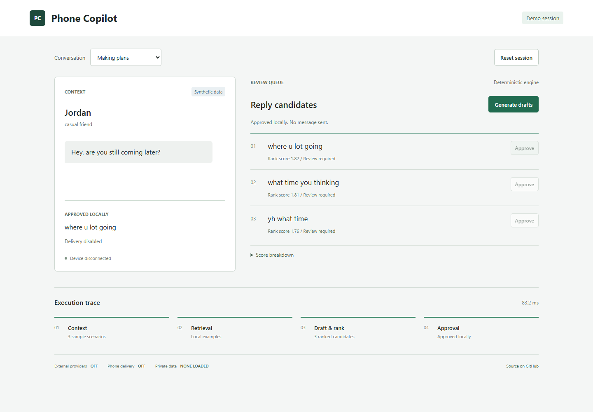
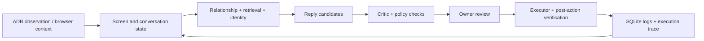

# Phone Copilot

A supervised Android assistant that turns visible conversation context into ranked reply drafts, then checks each action before it reaches the phone.

Python, FastAPI, ADB, SQLite, retrieval, browser extensions and a deterministic policy layer. The interesting part is the boundary between suggesting an action and actually executing it.



## Try the recording demo

Python 3.10 or newer. No phone, API key, model download or chat export is needed.

```sh
python -m venv .venv
# Windows: .venv\Scripts\activate
# macOS/Linux: source .venv/bin/activate
python -m pip install -e ".[dev]"
python -m apps.demo.main
```

Open [localhost:8766](http://127.0.0.1:8766). Choose a conversation, generate drafts, inspect the scores and approve a candidate. Approval stays inside the demo.

The demo runs the real deterministic drafting, retrieval and ranking path on fictional inputs. It does not run an LLM, connect to ADB, load `.env`, or deliver messages. The full controller supports optional model providers and real phone interaction separately.

## System overview



| Component | Responsibility |
| --- | --- |
| [Controller](apps/controller/) | API routes, orchestration, approvals and diagnostic views |
| [ADB adapter](libs/adb/) | Typed device operations, retries and screen observation |
| [Perception](libs/perception/) | OCR, UI hierarchy and screen classification |
| [Drafting](libs/drafting/) | Context, provider routing, retrieval, candidate scoring and conversation memory |
| [Planner and policies](libs/policies/) | Action preconditions, confidence gates and approval checks |
| [Training](apps/training/) | Local imports, reply pairs, style extraction and corrections |
| [WhatsApp Web extension](apps/browser_extension/whatsapp_web/) | Browser context bridge with review controls |
| [Recording demo](apps/demo/) | Isolated, repeatable demonstration using synthetic data |

## Engineering decisions

- **Observe before acting.** The executor checks the screen again and verifies the result of a device action. A stale coordinate is not enough to justify a tap.
- **Separate text quality from permission.** A convincing draft does not grant permission to send. Relationship rules, approval, duplicate checks, rate limits and stop conditions remain separate concerns.
- **Keep model providers optional.** The system includes local Ollama and configurable external adapters. Public defaults disable external requests and automatic sending.
- **Keep a local feedback loop.** Corrections can feed retrieval. Private chat exports, vector indexes and runtime databases stay outside Git.
- **Make decisions inspectable.** Candidates carry scores, risk flags and reasoning fields; controller pages expose state and execution traces.

## Live setup

See [SETUP.md](docs/SETUP.md) for Android, Ollama, optional vector retrieval and the browser extension. The controller is a local development tool without an authentication layer. Bind it to loopback; do not expose it to the internet.

The bundled identity is explicitly fictional. Configure owner-approved facts and contacts before live use. Unknown, family, professional, university and romantic relationships require review. Automatic sending is off in the public configuration.

## Tests

```sh
python -m pytest -q
python scripts/check_public_release.py --revision HEAD
```

The test suite covers drafting, policy checks, provider adapters, state, training, execution verification and demo isolation. [VALIDATION.md](docs/VALIDATION.md) records the checks performed for this release and their limits.

Current local result: **all tests pass**. The simulator, policy, provider, execution and demo checks run without expected-failure annotations.

## Project notes

- [Architecture and tradeoffs](docs/ARCHITECTURE.md)
- [Catbot conversation recovery and troubleshooting](docs/CATBOT.md)
- [Recording outline and technical walkthrough](docs/DEMO.md)
- [Public data boundary](docs/PRIVACY.md)
- [Security reporting](SECURITY.md)

This is a development project. The controller and drafting service still contain large orchestration modules and conversation heuristics. Device layouts and WhatsApp Web selectors can change; passing local tests does not establish reliability across every phone or live conversation.

Licensed under [MIT](LICENSE).
